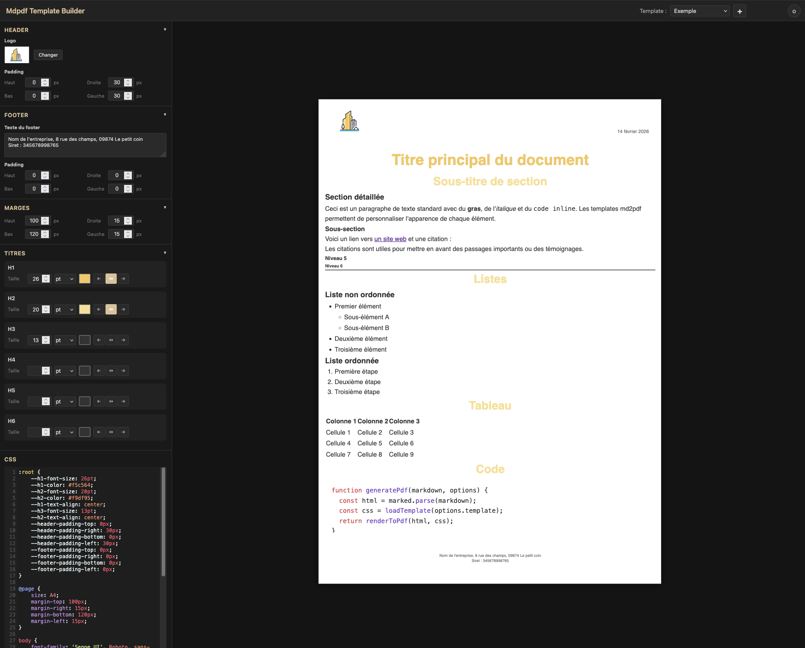

# mdpdf-template-builder

Éditeur visuel pour les templates [mdpdf](https://github.com/victorprouff/mdpdf). Permet de modifier le CSS d'un template et de visualiser le rendu en temps réel dans un aperçu A4.



## Fonctionnalités

- **Aperçu live A4** : rendu dans une iframe 794x1123px avec mise à l'échelle automatique
- **Éditeur CSS** : éditeur CodeMirror avec coloration syntaxique
- **Panneau accordéon** : sections Header, Footer, Marges et Titres collapsibles dans le sidebar
- **Contrôles visuels** : panneau pour modifier font-size, couleur et alignement des titres (h1-h6)
- **Marges de page** : contrôles pour les marges `@page` (top, right, bottom, left) avec sélection de l'unité (mm, cm, px)
- **Padding header/footer** : contrôles de padding internes pour le header et le footer, synchronisés avec le CSS et les fichiers HTML
- **Variables CSS** : les propriétés modifiables sont variabilisées dans `:root` (convention `--hN-property`, `--header-padding-*`, `--footer-padding-*`, `--logo-height`, `--show-date`)
- **Sauvegarde auto** : les modifications sont sauvegardées automatiquement sur le disque
- **Hot reload** : les modifications externes du fichier template sont détectées via WebSocket
- **Thème clair/sombre** : basculer via le bouton dans la toolbar
- **Création de template** : bouton "+" pour créer un nouveau template avec fichiers par défaut
- **Gestion du logo** : upload/remplacement du logo via la section Header, avec contrôle de la hauteur
- **Visibilité de la date** : afficher ou masquer la date dans le header via une checkbox
- **Édition du footer** : modification du texte du pied de page via la section Footer

## TODO :

- [ ] A la création d'un thème, rajouter par défaut la gestion des citations github
- [x] Pouvoir changer la taille du logo
- [x] Faire apparaitre ou non la date
- [ ] Padding ou marge des H*
- [ ] Dans l'interface, cacher le css par défaut et avoir une option pour le voir
- [ ] Avoir la possibilité d'installer l'app (Electron ? Web ?)


## Structure du projet

```
server/
  index.js                  # Point d'entrée Express + HTTP server
  routes/api.js             # API REST (CRUD templates) + génération preview
  services/template-service.js  # Lecture/écriture des templates (~/.mdpdf/templates/)
  services/css-generator.js     # Extraction des styles heading (côté serveur)
  services/markdown-service.js  # Rendu Markdown via marked + highlight.js
  websocket.js              # WebSocket server + chokidar file watcher
public/
  index.html                # Page principale
  css/app.css               # Layout + variables de thème
  css/controls.css          # Styles du panneau de contrôles + header/footer
  css/preview.css           # Styles de l'iframe preview
  js/app.js                 # Orchestrateur principal
  js/controls.js            # Panneau de contrôles (h1-h6)
  js/css-editor.js          # Wrapper CodeMirror
  js/header-footer.js       # Upload logo + hauteur logo + date + édition footer + padding header/footer
  js/margins.js             # Contrôles des marges @page
  js/preview.js             # Gestion iframe + scaling
  js/template-selector.js   # Sélection + création de template
  js/websocket-client.js    # Client WebSocket
data/
  sample.md                 # Markdown d'exemple pour l'aperçu
```

## Templates

Les templates sont lus depuis `~/.mdpdf/templates/`. Chaque template est un dossier contenant :

| Fichier        | Description                                                          |
| -------------- | -------------------------------------------------------------------- |
| `template.css` | Feuille de style du document (avec `@page`, `:root`, headings, etc.) |
| `header.html`  | HTML du header (supporte `{{LOGO}}` et `{{DATE}}`)                   |
| `footer.html`  | HTML du footer                                                       |
| `logo.png`     | Logo (optionnel, injecté en base64)                                  |

### Convention des variables CSS

Les propriétés modifiables via le panneau de contrôles sont déclarées dans `:root` :

```css
:root {
    --h1-font-size: 14pt;
    --h1-color: #153644;
    --h1-text-align: center;
    --h2-font-size: 12pt;
    --h2-color: #dcc29a;
    --header-padding-top: 10px;
    --header-padding-right: 20px;
    --header-padding-bottom: 5px;
    --header-padding-left: 20px;
    --footer-padding-top: 5px;
    --logo-height: 60px;
    --show-date: 1;
    /* ... */
}

h1 {
    font-size: var(--h1-font-size);
    color: var(--h1-color);
    text-align: var(--h1-text-align);
}
```

> **Note** : les variables `--header-padding-*`, `--footer-padding-*`, `--logo-height` et `--show-date` sont aussi appliquées en inline dans `header.html` pour être prises en compte par mdpdf lors de la génération PDF (Puppeteer rend le header/footer dans un contexte CSS isolé).

## Installation

```bash
npm install
```

## Utilisation

```bash
npm start
# ou en mode watch
npm run dev
```

Ouvrir http://localhost:3000.

## API

| Méthode | Route                         | Description                                    |
| ------- | ----------------------------- | ---------------------------------------------- |
| `GET`   | `/api/templates`              | Liste des templates disponibles                |
| `GET`   | `/api/templates/:name`        | Charge un template (CSS, header, footer, logo) |
| `POST`  | `/api/templates`              | Crée un nouveau template                       |
| `PUT`   | `/api/templates/:name/css`    | Sauvegarde le CSS d'un template                |
| `PUT`   | `/api/templates/:name/footer` | Sauvegarde le texte du footer                  |
| `PUT`   | `/api/templates/:name/padding`| Sauvegarde le padding header ou footer          |
| `PUT`   | `/api/templates/:name/header-options`| Sauvegarde la hauteur du logo et la visibilité de la date |
| `POST`  | `/api/templates/:name/logo`   | Upload/remplacement du logo (base64, max 5 Mo) |
| `GET`   | `/api/preview/:name`          | HTML complet de l'aperçu A4                    |

## WebSocket

Le serveur WebSocket écoute sur le même port et supporte :

- `watch-template` : surveille les changements de fichiers d'un template
- `update-css` : sauvegarde le CSS et notifie les autres clients
- `file-changed` (serveur -> client) : notification de modification externe
- `css-updated` (serveur -> client) : CSS mis à jour par un autre client