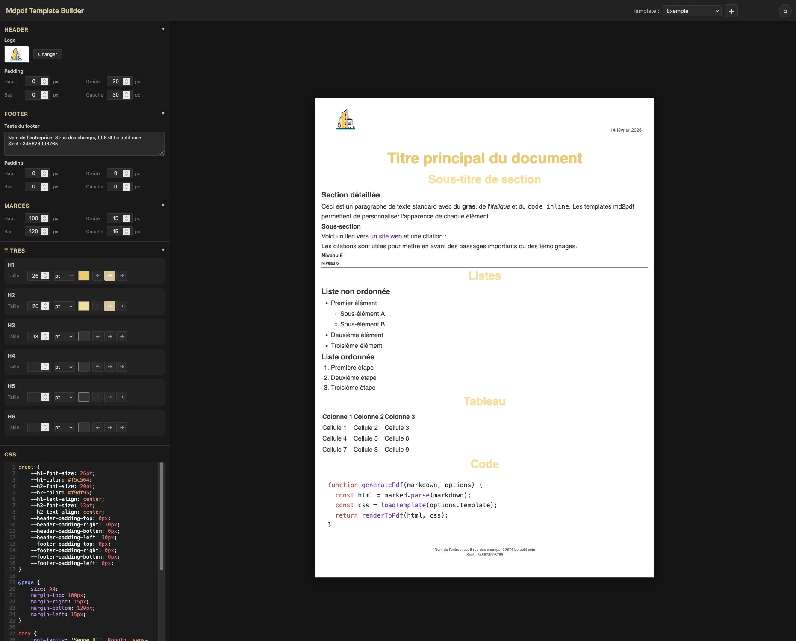

# mdpdf-template-builder

Éditeur visuel pour les templates [mdpdf](https://github.com/victorprouff/mdpdf). Permet de modifier le CSS d'un template et de visualiser le rendu en temps réel dans un aperçu A4.



## Fonctionnalités

- **Aperçu live A4** : rendu dans une iframe avec mise à l'échelle automatique, switchable portrait/paysage
- **Éditeur CSS** : éditeur CodeMirror avec coloration syntaxique
- **Panneau accordéon** : sections Header, Footer, Marges, Texte, Titres et CSS collapsibles dans le sidebar
- **Contrôles visuels titres** : font-size, couleur, alignement et marges (top/bottom) par heading h1-h6
- **Contrôles visuels texte** : font-size pour les paragraphes, cellules de tableau (td/th) et listes
- **Options tableau** : pleine largeur et hauteur des cellules td
- **Marges de page** : contrôles pour les marges `@page` (top, right, bottom, left) avec sélection de l'unité (mm, cm, px)
- **Padding header/footer** : contrôles de padding internes pour le header et le footer, synchronisés avec le CSS et les fichiers HTML
- **Visibilité** : afficher/masquer le header, le footer et le logo indépendamment
- **Variables CSS** : les propriétés modifiables sont variabilisées dans `:root`
- **Sauvegarde auto** : les modifications sont sauvegardées automatiquement sur le disque
- **Hot reload** : les modifications externes du fichier template sont détectées via WebSocket
- **Thème clair/sombre** : basculer via le bouton dans la toolbar
- **Création de template** : bouton "+" pour créer un nouveau template avec fichiers par défaut
- **Gestion du logo** : upload/remplacement du logo via la section Header, avec contrôle de la hauteur
- **Markdown par template** : chaque template peut avoir son propre `sample.md` pour un aperçu adapté à son contenu

## TODO :

- [ ] A la création d'un thème, rajouter par défaut la gestion des citations github
- [x] Pouvoir changer la taille du logo
- [x] Faire apparaitre ou non la date
- [x] Marges (top/bottom) des titres H1-H6
- [x] Régler la taille des paragraphes (p, td, li)
- [x] Afficher/masquer le header, le footer, le logo
- [x] Options tableau : pleine largeur, hauteur des cellules
- [x] Orientation portrait/paysage dans la preview
- [x] Markdown d'exemple par template (`sample.md`)
- [ ] Avoir des valeurs par défaut partout à la création d'un thème
- [ ] Valeur par défaut droite et gauche du padding header : 40px

- [ ] Avoir la possibilité d'installer l'app (Electron ? Web ?)

## Structure du projet

```
server/
  index.js                  # Point d'entrée Express + HTTP server
  routes/api.js             # API REST (CRUD templates) + génération preview
  services/template-service.js  # Lecture/écriture des templates (~/.mdpdf/templates/)
  services/css-generator.js     # Extraction des styles heading (côté serveur)
  services/markdown-service.js  # Rendu Markdown via marked + highlight.js
  websocket.js              # WebSocket server + chokidar file watcher
public/
  index.html                # Page principale
  css/app.css               # Layout + variables de thème
  css/controls.css          # Styles du panneau de contrôles + header/footer
  css/preview.css           # Styles de l'iframe preview
  js/app.js                 # Orchestrateur principal
  js/controls.js            # Panneau de contrôles (h1-h6)
  js/css-editor.js          # Wrapper CodeMirror
  js/header-footer.js       # Upload logo + hauteur logo + date + édition footer + padding header/footer
  js/margins.js             # Contrôles des marges @page
  js/preview.js             # Gestion iframe + scaling
  js/template-selector.js   # Sélection + création de template
  js/websocket-client.js    # Client WebSocket
data/
  sample.md                 # Markdown d'exemple pour l'aperçu
```

## Templates

Les templates sont lus depuis `~/.mdpdf/templates/`. Chaque template est un dossier contenant :

| Fichier        | Description                                                          |
| -------------- | -------------------------------------------------------------------- |
| `template.css` | Feuille de style du document (avec `@page`, `:root`, headings, etc.) |
| `header.html`  | HTML du header (supporte `{{LOGO}}` et `{{DATE}}`)                   |
| `footer.html`  | HTML du footer                                                       |
| `logo.png`     | Logo (optionnel, injecté en base64)                                  |
| `sample.md`    | Markdown d'aperçu spécifique au template (optionnel, prioritaire sur `data/sample.md`) |

### Convention des variables CSS

Les propriétés modifiables via le panneau de contrôles sont déclarées dans `:root` :

```css
:root {
    /* Titres */
    --h1-font-size: 14pt;
    --h1-color: #153644;
    --h1-text-align: center;
    --h1-margin-top: 0px;
    --h1-margin-bottom: 15px;

    /* Texte */
    --p-font-size: 10pt;
    --td-font-size: 10pt;
    --li-font-size: 10pt;

    /* Tableau */
    --table-width: 100%;
    --td-height: 30px;

    /* Header / Footer */
    --header-padding-top: 10px;
    --header-padding-right: 20px;
    --header-padding-bottom: 5px;
    --header-padding-left: 20px;
    --footer-padding-top: 5px;
    --logo-height: 60px;

    /* Visibilité (0 = caché, 1 = visible) */
    --show-date: 1;
    --show-header: 1;
    --show-logo: 1;
    --show-footer: 1;
}
```

> **Note** : les variables `--header-padding-*`, `--footer-padding-*`, `--logo-height`, `--show-date`, `--show-header`, `--show-logo` et `--show-footer` sont aussi appliquées en inline dans `header.html`/`footer.html` pour être prises en compte par Puppeteer lors de la génération PDF (le header/footer est rendu dans un contexte CSS isolé).

### Largeur des colonnes de tableau

Pour les templates avec des tableaux à structure fixe (ex : feuilles de présence), utiliser `table-layout: fixed` avec des largeurs explicites par colonne via `nth-child` :

```css
table {
    width: 100%;
    table-layout: fixed;
}

td, th {
    word-break: break-word;
    overflow: hidden;
}

/* Exemple : Nom | Prénom | Entreprise | Sig. matin | Sig. après-midi */
th:nth-child(1), td:nth-child(1) { width: 18%; }
th:nth-child(2), td:nth-child(2) { width: 18%; }
th:nth-child(3), td:nth-child(3) { width: 20%; }
th:nth-child(4), td:nth-child(4) { width: 22%; }
th:nth-child(5), td:nth-child(5) { width: 22%; }
```

Cette approche garantit que les colonnes signature ont toujours la largeur voulue, indépendamment du contenu des autres colonnes.

## Installation

```bash
npm install
```

## Utilisation

```bash
npm start
# ou en mode watch
npm run dev
```

Ouvrir http://localhost:3000.

## API

| Méthode | Route                                | Description                                                      |
| ------- | ------------------------------------ | ---------------------------------------------------------------- |
| `GET`   | `/api/templates`                     | Liste des templates disponibles                                  |
| `GET`   | `/api/templates/:name`               | Charge un template (CSS, header, footer, logo)                   |
| `POST`  | `/api/templates`                     | Crée un nouveau template                                         |
| `PUT`   | `/api/templates/:name/css`           | Sauvegarde le CSS d'un template                                  |
| `PUT`   | `/api/templates/:name/footer`        | Sauvegarde le texte du footer                                    |
| `PUT`   | `/api/templates/:name/padding`       | Sauvegarde le padding header ou footer                           |
| `PUT`   | `/api/templates/:name/header-options`| Logo height, show-date, show-header, show-logo                   |
| `PUT`   | `/api/templates/:name/footer-options`| Visibilité du footer (show-footer)                               |
| `POST`  | `/api/templates/:name/logo`          | Upload/remplacement du logo (base64, max 5 Mo)                   |
| `GET`   | `/api/preview/:name`                 | HTML complet de l'aperçu (`?orientation=portrait\|landscape`)    |

## WebSocket

Le serveur WebSocket écoute sur le même port et supporte :

- `watch-template` : surveille les changements de fichiers d'un template
- `update-css` : sauvegarde le CSS et notifie les autres clients
- `file-changed` (serveur -> client) : notification de modification externe
- `css-updated` (serveur -> client) : CSS mis à jour par un autre client